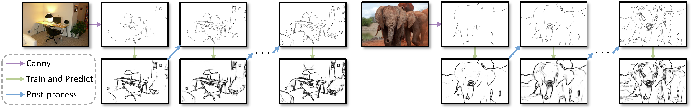

# STEdge: Self-training Edge Detection with Multi-layer Teaching and Regularization

Official implementation of the paper:

STEdge: Self-training Edge Detection with Multi-layer Teaching and Regularization[[arXiv](https://arxiv.org/abs/2201.05121)].

[Yunfan Ye](https://yunfan1202.github.io), 
[Renjiao Yi](https://renjiaoyi.github.io/),
[Zhiping Cai](), 
[Kai Xu](http://kevinkaixu.net/index.html).

## Changelog 

* [Aug 2023] Initial release of code.


## Abstract

Learning-based edge detection has hereunto been strongly supervised with pixel-wise annotations which are tedious to obtain manually. We study the problem of self-training edge detection, leveraging the untapped wealth of large-scale unlabeled image datasets. We design a self-supervised framework with multi-layer regularization and self-teaching. In particular, we impose a consistency regularization which enforces the outputs from each of the multiple layers to be consistent for the input image and its perturbed counterpart. We adopt L0-smoothing as the 'perturbation' to encourage edge prediction lying on salient boundaries following the cluster assumption in self-supervised learning. Meanwhile, the network is trained with multi-layer supervision by pseudo labels which are initialized with Canny edges and then iteratively refined by the network as the training proceeds. The regularization and self-teaching together attain a good balance of precision and recall, leading to a significant performance boost over supervised methods, with lightweight refinement on the target dataset. Furthermore, our method demonstrates strong cross-dataset generality. For example, it attains 4.8% improvement for ODS and 5.8% for OIS when tested on the unseen BIPED dataset, compared to the state-of-the-art methods.


## Enviroments
This code has been tested with Ubuntu 18.04, one 3080Ti GPU with CUDA 11.4, Python 3.8, Pytorch 1.12.

Ealier versions may also work.

## The code still needs further cleaning.
If you are in a hurry to use the code, please feel free to contact me if you meet any problem. I will organize the code after finishing my current and urgent project. Thanks for your patience.


## Usage
Download the DexiNed model from [Google Drive](https://drive.google.com/drive/folders/14MEsjd-AG9pI3Q94kEbCubu96_4PoWj3?usp=sharing), which is pre-trained only on COCO-val dataset with Canny [300, 400], and and then run the following code for the self-training process:
```bash
python self_train.py
```

## Citation
```bibtex
@ARTICLE{10187181,
  author={Ye, Yunfan and Yi, Renjiao and Cai, Zhiping and Xu, Kai},
  journal={IEEE Transactions on Neural Networks and Learning Systems}, 
  title={STEdge: Self-Training Edge Detection With Multilayer Teaching and Regularization}, 
  year={2023},
  volume={},
  number={},
  pages={1-11},
  doi={10.1109/TNNLS.2023.3292905}}
```

## Acknowledgements

- [PiDiNet](https://github.com/hellozhuo/pidinet)
- [DexiNed](https://github.com/xavysp/DexiNed)
